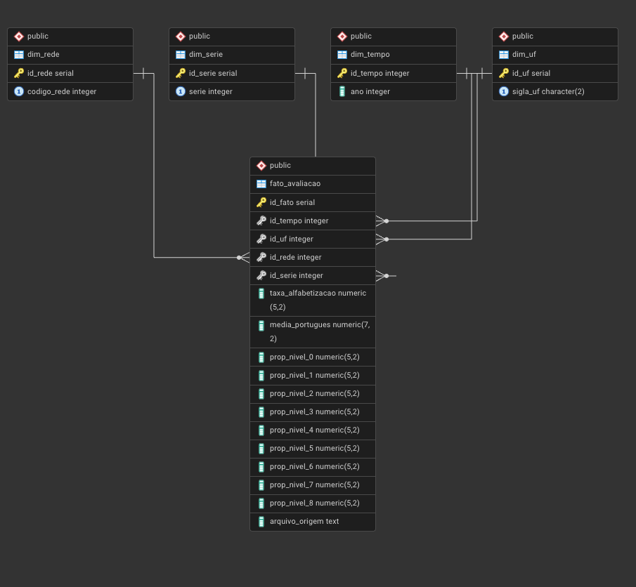
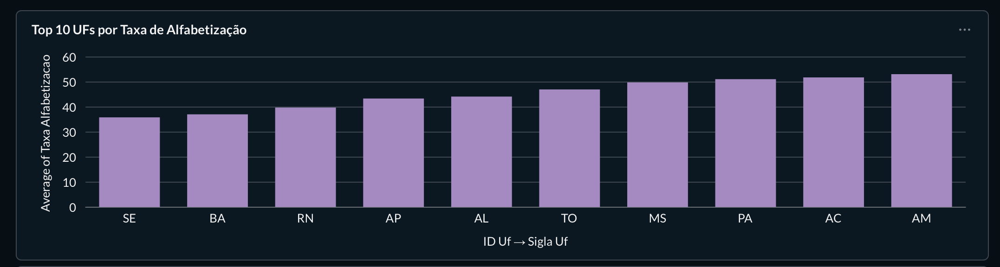
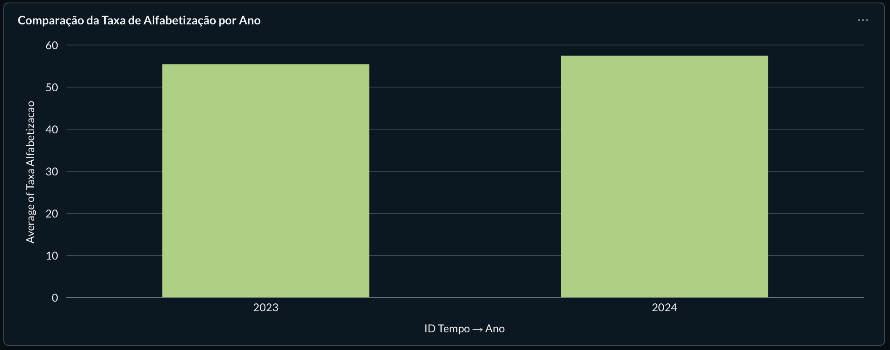
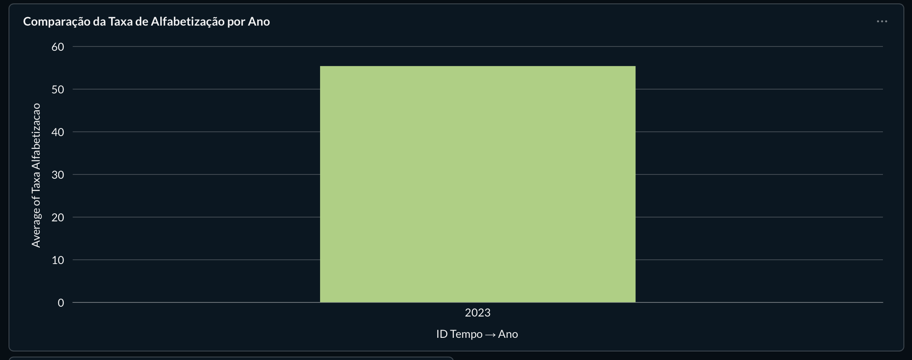

# Projeto Data Warehouse e Business Intelligence

## Avaliação de Alfabetização — INEP

**Curso:** Análise e Desenvolvimento de Sistemas  
**Disciplina:** Business Intelligence / Data Warehouse   
**Aluna:** *Júlia Laitharth*  

***

##  1. Introdução

Este projeto tem como objetivo a construção de um **Data Warehouse (DW)** e o desenvolvimento de **dashboards de BI** a partir de dados reais da **Avaliação de Alfabetização do INEP**, aplicando conceitos de **modelagem dimensional**, **ETL (Extract, Transform, Load)** e **análise analítica interativa**.

A solução visa apoiar a análise educacional por **Unidade da Federação (UF)** e **ano**, permitindo comparações, identificação de padrões e melhor compreensão do desempenho educacional.

***

## 2. Objetivos

### Objetivo Geral

Construir um ambiente de BI completo, desde a modelagem do DW até a visualização interativa dos dados.

### Objetivos Específicos

*   Modelar um Data Warehouse em **Star Schema**
*   Implementar um processo de ETL em Python
*   Carregar dados em banco relacional (PostgreSQL)
*   Desenvolver dashboards interativos no **Metabase**
*   Criar perguntas analíticas com filtros dinâmicos

***

## 3. Conjunto de Dados

*   **Fonte:** INEP — Avaliação de Alfabetização
*   **Formato:** CSV
*   **Arquivo:** `br_inep_avaliacao_alfabetizacao_uf.csv`
*   **Período:** 2023 e 2024
*   **Granularidade:** Dados agregados por UF

### Principais campos do dataset:

*   Ano da avaliação
*   Unidade da Federação (UF)
*   Taxa de alfabetização
*   Média de proficiência em Língua Portuguesa
*   Proporção de alunos por níveis de proficiência (níveis 0 a 8)

***

## 4. Modelagem do Data Warehouse

O Data Warehouse foi modelado utilizando o **Star Schema**, composto por uma tabela fato e tabelas dimensão.

### Tabela Fato

**fato\_avaliacao**

*   taxa\_alfabetizacao
*   media\_portugues
*   proporcao\_aluno\_nivel\_0 a proporcao\_aluno\_nivel\_8

### Tabelas Dimensão

*   **dim\_tempo** (ano)
*   **dim\_uf** (sigla\_uf)
*   **dim\_serie**
*   **dim\_rede**

***

## 5. Processo ETL

O processo de ETL foi desenvolvido em **Python**, utilizando a biblioteca **Pandas**.

### Extract

*   Leitura do arquivo CSV do INEP

### Transform

*   Padronização de tipos de dados
*   Tratamento de valores nulos
*   Normalização das informações
*   Preparação de tabelas dimensionais e fato

### Load

*   Carga dos dados no banco PostgreSQL
*   Inserção controlada para garantir consistência dos dados

***

## 6. Ferramentas Utilizadas

*   **Python** (ETL)
*   **PostgreSQL** (Data Warehouse)
*   **Metabase** (Dashboards e análises BI)
*   **Git/GitHub** (Versionamento)

***

## 7. Dashboards e Perguntas Analíticas

Os dashboards foram desenvolvidos exclusivamente no **Metabase**, utilizando o **construtor visual**, sem uso de SQL nativo, garantindo compatibilidade total com filtros interativos.

### Perguntas implementadas (5):

***

### 7.1 Ranking das UFs por Taxa de Alfabetização

*   **Tipo:** Gráfico de Barras
*   **Objetivo:** Comparar o desempenho educacional entre os estados

***

### 7.2 Comparação da Taxa de Alfabetização por Ano

*   **Tipo:** Gráfico de Barras
*   **Objetivo:** Comparar os resultados entre 2023 e 2024

**Com filtro: 2023**

***

### 📈 7.3 Evolução da Taxa de Alfabetização ao Longo do Tempo

*   **Tipo:** Gráfico de Área
*   **Objetivo:** Visualizar a tendência temporal do indicador

📷 **Imagem do gráfico:**

> *Inserir imagem aqui*

***

### 📊 7.4 Distribuição dos Alunos por Nível de Proficiência

*   **Tipo:** Gráfico de Barras Empilhadas
*   **Objetivo:** Avaliar a qualidade do aprendizado por UF

📷 **Imagem do gráfico:**

> *Inserir imagem aqui*

***

### 📋 7.5 Tabela de Indicadores de Alfabetização por UF

*   **Tipo:** Tabela
*   **Objetivo:** Exibir valores exatos para análise detalhada

📷 **Imagem da tabela:**

> *Inserir imagem aqui*

***

## 🎛️ 8. Filtros do Dashboard

O dashboard possui filtros globais que permitem análise interativa:

*   **Filtro de Ano**
    *   Permite selecionar 2023 ou 2024
*   **Filtro de UF**
    *   Permite selecionar uma ou mais Unidades da Federação

> **Importante:** não foi utilizado filtro global de taxa de alfabetização, pois trata-se de uma métrica agregada. As análises por faixa de taxa foram realizadas diretamente nas perguntas, garantindo consistência analítica.

***

## 📈 9. Análises Possíveis

*   Comparação do desempenho educacional entre estados
*   Avaliação da evolução da alfabetização ao longo do tempo
*   Identificação de UFs com maior ou menor desempenho
*   Análise da distribuição dos alunos por níveis de proficiência
*   Exploração interativa através de filtros dinâmicos

***

## ✅ 10. Conclusão

O projeto evidenciou a aplicação prática de conceitos de **Data Warehouse e Business Intelligence**, utilizando dados públicos e reais do INEP. A solução desenvolvida permite análises claras, interativas e fundamentadas, podendo ser expandida futuramente com novos dados, períodos ou indicadores educacionais.

***

## 📂 11. Estrutura do Projeto

    📁 projeto_dw_inep/
     ├── etl/
     │    └── etl_inep.py
     ├── database/
     │    └── ddl_dw.sql
     ├── data/
     │    └── br_inep_avaliacao_alfabetizacao_uf.csv
     ├── dashboards/
     │    └── prints_metabase/
     └── README.md

